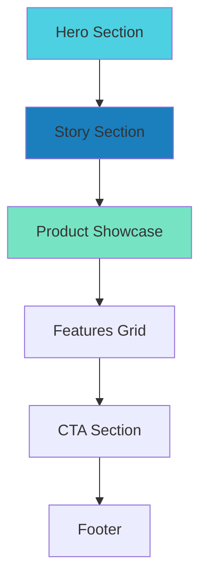

# AquaSense Design System - Technical Design Document

## Overview

The AquaSense Design System is a comprehensive visual language and component library that transforms the generic SaaS interface into a distinctive, water-inspired experience purpose-built for swimming pool operations. This design system embodies Scandinavian aesthetic principles—clean, minimal, and functional—while incorporating fluid motion, caustic patterns, glass effects, and layered depth to create a premium aquatic feel.

### Design Philosophy

**Scandinavian Minimalism**: Clean lines, ample whitespace, functional beauty  
**Water-Inspired**: Fluid motion, caustic light patterns, glass-like surfaces, ripple effects  
**Premium Feel**: Layered depth, soft shadows, subtle reflections, careful attention to detail  
**Mobile-First**: Touch-optimized interactions, one-hand navigation, thumb-zone awareness  
**Performance**: CSS transforms over layout-triggering properties, optimized SVGs, lazy loading  
**Accessibility**: WCAG 2.1 AA compliance, keyboard navigation, reduced motion support

### Technical Stack Integration

- **Next.js 14** with App Router and React Server Components
- **TypeScript** (strict mode) for type safety
- **Tailwind CSS** extended with custom design tokens
- **Framer Motion** for complex animations and microinteractions
- **shadcn/ui** as the base component library (customized with AquaSense design language)
- **next-intl** for bilingual support (Danish/English)
- **SVG** for scalable, performant icons and graphics


## Architecture

### System Architecture Diagram

```mermaid
graph TB
    A[Design Tokens] --> B[Component Library]
    A --> C[Global Styles]
    B --> D[Page Templates]
    C --> D
    D --> E[Landing Page]
    D --> F[Dashboard Pages]
    D --> G[Auth Pages]
    
    H[Motion System] --> B
    H --> D
    
    I[Theme Provider] --> A
    I --> C
    
    J[Responsive System] --> B
    J --> D
    
    K[Accessibility Layer] --> B
    K --> D
    
    style A fill:#4DD0E1
    style B fill:#1B7FBD
    style H fill:#76E4C3
    style I fill:#0A3D62
```



### Design System Layers


**1. Foundation Layer (Design Tokens)**
- Color system (light & dark mode)
- Typography scales
- Spacing system (4px base unit)
- Shadow tokens for depth
- Border radius tokens
- Motion/easing functions

**2. Component Layer**
- Primitive components (Button, Input, Card)
- Composite components (Navigation, Forms, Data Display)
- Layout components (Container, Grid, Stack)
- All components built on design tokens

**3. Pattern Layer**
- Navigation patterns (Desktop Rail, Mobile Bottom Nav)
- Form patterns
- Data visualization patterns
- Feedback patterns (loading, success, error)

**4. Page Template Layer**
- Landing page template
- Dashboard template
- Auth page template
- Content page template


### File Structure

```
app/
├── [locale]/
│   ├── layout.tsx           # Root layout with theme provider
│   ├── page.tsx              # Landing page
│   └── (auth)/
│       └── login/
│           └── page.tsx      # Login page (redesigned)
│
components/
├── ui/                       # shadcn/ui base components (customized)
│   ├── button.tsx
│   ├── input.tsx
│   ├── card.tsx
│   └── ...
├── design-system/            # AquaSense-specific components
│   ├── Logo.tsx
│   ├── NavigationRail.tsx
│   ├── BottomNavigation.tsx
│   ├── WaterBackground.tsx
│   ├── FloatingCard.tsx
│   └── ...
├── landing/                  # Landing page sections
│   ├── HeroSection.tsx
│   ├── StorySection.tsx
│   └── ProductShowcase.tsx
│
lib/
├── design-tokens/
│   ├── colors.ts
│   ├── typography.ts
│   ├── spacing.ts
│   ├── shadows.ts
│   └── motion.ts
│
public/
├── assets/
│   ├── logo/
│   │   ├── logo-full.svg
│   │   ├── logo-icon.svg
│   │   └── logo-wordmark.svg
│   └── water-patterns/
│       ├── caustic.svg
│       └── ripple.svg
│
styles/
├── globals.css              # Global styles with design tokens
└── animations.css           # Water-inspired animation keyframes
```


## Components and Interfaces

### Component Architecture Overview

The AquaSense Design System is built on a hierarchical component architecture that extends shadcn/ui with custom water-inspired styling. All components are TypeScript-based React components with strict type definitions.

### Core Component Interfaces

#### Button Component

```typescript
// components/ui/button.tsx

interface ButtonProps extends React.ButtonHTMLAttributes<HTMLButtonElement> {
  variant?: 'primary' | 'secondary' | 'ghost' | 'destructive';
  size?: 'sm' | 'md' | 'lg';
  loading?: boolean;
  disabled?: boolean;
  icon?: React.ReactNode;
  children: React.ReactNode;
}
```

**Variants:**
- `primary`: Solid background with primary color
- `secondary`: Outline style with transparent background
- `ghost`: No background, minimal styling
- `destructive`: Red/error color for dangerous actions

**Sizes:**
- `sm`: 44px height (minimum touch target)
- `md`: 48px height (default)
- `lg`: 56px height (prominent actions)

#### Input Component

```typescript
// components/ui/input.tsx

interface InputProps extends React.InputHTMLAttributes<HTMLInputElement> {
  label?: string;
  error?: string;
  helperText?: string;
  icon?: React.ReactNode;
  variant?: 'default' | 'filled';
}
```

**States:**
- Default: Standard border with subtle styling
- Focus: Accent color border with glow effect
- Error: Red border with error message
- Disabled: Reduced opacity, no interaction

#### FloatingCard Component

```typescript
// components/design-system/FloatingCard.tsx

interface FloatingCardProps {
  children: React.ReactNode;
  hover?: boolean;           // Enable hover elevation
  glass?: boolean;           // Glass effect
  className?: string;
}
```

**Variants:**
- Standard: Solid background with shadow
- Glass: Translucent background with backdrop blur
- Hover: Animated elevation on mouse over

#### Logo Component

```typescript
// components/design-system/Logo.tsx

interface LogoProps {
  variant?: 'full' | 'icon' | 'wordmark';
  size?: number;             // Width/height in pixels
  className?: string;
}
```

**Variants:**
- `full`: Icon + wordmark
- `icon`: Symbol only
- `wordmark`: Text only

### Navigation Components

#### NavigationRail (Desktop)

```typescript
// components/design-system/NavigationRail.tsx

interface NavigationRailProps {
  items: NavigationItem[];
  currentPath: string;
  userName: string;
}

interface NavigationItem {
  label: string;
  href: string;
  icon: React.ReactNode;
  badge?: number;            // Optional notification count
}
```

**Layout:**
- Fixed position, left sidebar
- 280px width on desktop (≥1024px)
- Logo at top, navigation items in middle, user profile at bottom

#### BottomNavigation (Mobile)

```typescript
// components/design-system/BottomNavigation.tsx

interface BottomNavigationProps {
  items: NavigationItem[];   // Maximum 5 items
  currentPath: string;
}
```

**Layout:**
- Fixed position, bottom of viewport
- 72px height (includes safe area)
- Centered icons with labels
- Only visible on mobile/tablet (<1024px)

### Background and Effect Components

#### WaterReflection

```typescript
// components/design-system/WaterReflection.tsx

interface WaterReflectionProps {
  opacity?: number;          // 0-1, default 0.1
  speed?: number;            // Animation speed multiplier
  className?: string;
}
```

**Purpose:** Animated SVG caustic pattern for backgrounds

#### WaterBackground

```typescript
// components/design-system/WaterBackground.tsx

interface WaterBackgroundProps {
  variant?: 'light' | 'dark';
  intensity?: 'subtle' | 'medium' | 'strong';
  children?: React.ReactNode;
}
```

**Purpose:** Gradient background with optional caustic overlay

### Data Visualization Components

#### CircularProgress

```typescript
// components/design-system/CircularProgress.tsx

interface CircularProgressProps {
  value: number;             // 0-100
  size?: number;             // Diameter in pixels
  strokeWidth?: number;      // Ring thickness
  label?: string;
  color?: string;            // Defaults to accent color
}
```

#### Timeline

```typescript
// components/design-system/Timeline.tsx

interface TimelineProps {
  items: TimelineItem[];
}

interface TimelineItem {
  time: string;
  title: string;
  description?: string;
  status: 'completed' | 'active' | 'pending';
  icon?: React.ReactNode;
}
```

### Form Components

#### Input Variants

```typescript
// All input components extend base InputProps

// Text Input (standard)
interface TextInputProps extends InputProps {
  type?: 'text' | 'email' | 'password' | 'tel' | 'url';
}

// Textarea
interface TextareaProps extends InputProps {
  rows?: number;
  maxLength?: number;
}

// Select
interface SelectProps extends InputProps {
  options: SelectOption[];
  placeholder?: string;
}

interface SelectOption {
  value: string;
  label: string;
  disabled?: boolean;
}

// Date Input
interface DateInputProps extends InputProps {
  min?: string;
  max?: string;
  format?: string;
}
```

### Layout Components

#### Container

```typescript
// components/design-system/Container.tsx

interface ContainerProps {
  size?: 'sm' | 'md' | 'lg' | 'full';
  children: React.ReactNode;
  className?: string;
}
```

**Max Widths:**
- `sm`: 768px (3xl)
- `md`: 1024px (5xl)
- `lg`: 1280px (7xl)
- `full`: No max-width

#### ResponsiveGrid

```typescript
// components/design-system/ResponsiveGrid.tsx

interface ResponsiveGridProps {
  columns?: {
    mobile?: number;         // Default: 1
    tablet?: number;         // Default: 2
    desktop?: number;        // Default: 3
  };
  gap?: number;              // Spacing unit (4, 6, 8)
  children: React.ReactNode;
}
```

### Landing Page Components

#### HeroSection

```typescript
// components/landing/HeroSection.tsx

interface HeroSectionProps {
  headline: string;
  subheadline: string;
  ctaText: string;
  ctaHref: string;
  backgroundVariant?: 'default' | 'intense';
}
```

#### StorySection

```typescript
// components/landing/StorySection.tsx

interface StorySectionProps {
  stages: OperationalStage[];
}

interface OperationalStage {
  time: string;
  title: string;
  description: string;
  icon: React.ReactNode;
  imageUrl?: string;
}
```

#### ProductShowcase

```typescript
// components/landing/ProductShowcase.tsx

interface ProductShowcaseProps {
  title: string;
  subtitle?: string;
  mockups: DeviceMockup[];
}

interface DeviceMockup {
  device: 'mobile' | 'tablet';
  screenshot: string;        // Path to screenshot
  alt: string;
  position?: 'left' | 'center' | 'right';
}
```

### Utility Components

#### ThemeToggle

```typescript
// components/design-system/ThemeToggle.tsx

interface ThemeToggleProps {
  variant?: 'button' | 'switch';
  className?: string;
}
```

#### LanguageSelector

```typescript
// components/design-system/LanguageSelector.tsx

interface LanguageSelectorProps {
  variant?: 'dropdown' | 'inline';
  className?: string;
}
```

#### ErrorMessage

```typescript
// components/design-system/ErrorMessage.tsx

interface ErrorMessageProps {
  message: string;
  title?: string;
  dismissible?: boolean;
  onDismiss?: () => void;
}
```

#### LoadingSpinner

```typescript
// components/design-system/LoadingSpinner.tsx

interface LoadingSpinnerProps {
  size?: 'sm' | 'md' | 'lg';
  color?: string;            // Defaults to accent color
  label?: string;
}
```

### Animation Wrappers

#### ScrollReveal

```typescript
// components/design-system/ScrollReveal.tsx

interface ScrollRevealProps {
  children: React.ReactNode;
  delay?: number;            // Delay in seconds
  direction?: 'up' | 'down' | 'left' | 'right';
  once?: boolean;            // Animate only once
}
```

#### RippleButton

```typescript
// components/design-system/RippleButton.tsx

interface RippleButtonProps extends ButtonProps {
  rippleColor?: string;      // Defaults to white with opacity
  rippleDuration?: number;   // Duration in ms (default: 600)
}
```

## Data Models

### Design Token Models

#### ColorTokens

```typescript
// lib/design-tokens/colors.ts

interface ColorScale {
  50: string;
  100: string;
  200: string;
  300: string;
  400: string;
  500: string;
  600: string;
  700: string;
  800: string;
  900: string;
}

interface ColorSystem {
  primary: ColorScale;
  secondary: ColorScale;
  accent: ColorScale;
  highlight: ColorScale;
  neutral: ColorScale;
  semantic: {
    success: { light: string; main: string; dark: string };
    warning: { light: string; main: string; dark: string };
    error: { light: string; main: string; dark: string };
    info: { light: string; main: string; dark: string };
  };
}

interface DarkModeColors {
  background: {
    primary: string;
    secondary: string;
    surface: string;
    elevated: string;
  };
  text: {
    primary: string;
    secondary: string;
    muted: string;
  };
  border: {
    default: string;
    subtle: string;
  };
  primary: string;
  secondary: string;
  accent: string;
  highlight: string;
}
```

#### TypographyTokens

```typescript
// lib/design-tokens/typography.ts

interface FontSizeScale {
  xs: string;      // 12px
  sm: string;      // 14px
  base: string;    // 16px
  lg: string;      // 18px
  xl: string;      // 20px
  '2xl': string;   // 24px
  '3xl': string;   // 30px
  '4xl': string;   // 36px
  '5xl': string;   // 48px
  '6xl': string;   // 60px
}

interface FontWeights {
  normal: string;   // 400
  medium: string;   // 500
  semibold: string; // 600
  bold: string;     // 700
}

interface LineHeights {
  tight: string;    // 1.25
  snug: string;     // 1.375
  normal: string;   // 1.5
  relaxed: string;  // 1.625
  loose: string;    // 2
}

interface HeadingStyle {
  mobile: {
    fontSize: string;
    lineHeight: string;
    fontWeight: string;
    letterSpacing?: string;
  };
  desktop: {
    fontSize: string;
    lineHeight: string;
    fontWeight: string;
    letterSpacing?: string;
  };
}

interface TypographySystem {
  fontSize: FontSizeScale;
  fontWeight: FontWeights;
  lineHeight: LineHeights;
  headingStyles: {
    h1: HeadingStyle;
    h2: HeadingStyle;
    h3: HeadingStyle;
    h4: HeadingStyle;
    h5: HeadingStyle;
    h6: HeadingStyle;
  };
  bodyStyles: {
    large: { fontSize: string; lineHeight: string; fontWeight: string };
    base: { fontSize: string; lineHeight: string; fontWeight: string };
    small: { fontSize: string; lineHeight: string; fontWeight: string };
    caption: { fontSize: string; lineHeight: string; fontWeight: string };
  };
}
```

#### SpacingTokens

```typescript
// lib/design-tokens/spacing.ts

interface SpacingScale {
  0: string;       // 0
  1: string;       // 4px
  2: string;       // 8px
  3: string;       // 12px
  4: string;       // 16px
  5: string;       // 20px
  6: string;       // 24px
  8: string;       // 32px
  10: string;      // 40px
  12: string;      // 48px
  16: string;      // 64px
  20: string;      // 80px
  24: string;      // 96px
  32: string;      // 128px
}
```

#### ShadowTokens

```typescript
// lib/design-tokens/shadows.ts

interface ShadowSystem {
  sm: string;
  base: string;
  md: string;
  lg: string;
  xl: string;
  '2xl': string;
  glass: string;
  water: string;
}
```

#### MotionTokens

```typescript
// lib/design-tokens/motion.ts

interface EasingFunctions {
  waterFlow: string;      // cubic-bezier(0.4, 0.0, 0.2, 1)
  waterRipple: string;    // cubic-bezier(0.34, 1.56, 0.64, 1)
  waterWave: string;      // cubic-bezier(0.65, 0, 0.35, 1)
  easeIn: string;
  easeOut: string;
  easeInOut: string;
}

interface DurationScale {
  fast: string;      // 150ms
  base: string;      // 250ms
  slow: string;      // 400ms
  slower: string;    // 600ms
}

interface MotionSystem {
  easing: EasingFunctions;
  duration: DurationScale;
}
```

#### BorderRadiusTokens

```typescript
// lib/design-tokens/radius.ts

interface BorderRadiusScale {
  none: string;      // 0
  sm: string;        // 6px
  base: string;      // 8px
  md: string;        // 12px
  lg: string;        // 16px
  xl: string;        // 24px
  '2xl': string;     // 32px
  full: string;      // 9999px
}
```

### Theme Configuration

```typescript
// lib/theme/theme-config.ts

interface ThemeConfig {
  colors: ColorSystem;
  darkColors: DarkModeColors;
  typography: TypographySystem;
  spacing: SpacingScale;
  shadows: ShadowSystem;
  darkShadows: ShadowSystem;
  borderRadius: BorderRadiusScale;
  motion: MotionSystem;
  breakpoints: {
    sm: string;      // 640px
    md: string;      // 768px
    lg: string;      // 1024px
    xl: string;      // 1280px
    '2xl': string;   // 1536px
  };
}
```

### Component State Models

#### ButtonState

```typescript
interface ButtonState {
  variant: 'primary' | 'secondary' | 'ghost' | 'destructive';
  size: 'sm' | 'md' | 'lg';
  loading: boolean;
  disabled: boolean;
  hovered: boolean;
  pressed: boolean;
  focused: boolean;
}
```

#### InputState

```typescript
interface InputState {
  value: string;
  focused: boolean;
  error: string | null;
  disabled: boolean;
  touched: boolean;
  dirty: boolean;
}
```

#### NavigationState

```typescript
interface NavigationState {
  currentPath: string;
  items: NavigationItem[];
  isOpen: boolean;        // For mobile menu
  userName: string;
  userAvatar?: string;
}
```

### Animation State Models

#### RippleState

```typescript
interface Ripple {
  x: number;             // X coordinate of ripple origin
  y: number;             // Y coordinate of ripple origin
  id: number;            // Unique identifier (timestamp)
}

interface RippleState {
  ripples: Ripple[];
}
```

#### PageTransitionState

```typescript
interface PageTransitionState {
  initial: { opacity: number; y: number };
  animate: { opacity: number; y: number };
  exit: { opacity: number; y: number };
}
```

### Landing Page Data Models

#### OperationalStage

```typescript
interface OperationalStage {
  time: string;            // e.g., "07:00"
  title: string;
  description: string;
  icon: React.ReactNode;
  imageUrl?: string;
}
```

#### DeviceMockup

```typescript
interface DeviceMockup {
  device: 'mobile' | 'tablet';
  screenshot: string;
  alt: string;
  position?: 'left' | 'center' | 'right';
  className?: string;
}
```

## Design Token System

### Color System

The AquaSense color palette is inspired by water depths, aquatic environments, and Scandinavian clarity. All colors are defined as design tokens and mapped to both light and dark modes.

#### Primary Colors

```typescript
// lib/design-tokens/colors.ts

export const colors = {
  // Primary: Deep Ocean - Trustworthy, stable, professional
  primary: {
    50: '#E3F2FD',
    100: '#BBDEFB',
    200: '#90CAF9',
    300: '#64B5F6',
    400: '#42A5F5',
    500: '#0A3D62',  // Main primary color
    600: '#083351',
    700: '#062840',
    800: '#041D2F',
    900: '#02121E',
  },
  
  // Secondary: Pool Blue - Energetic, clear, refreshing
  secondary: {
    50: '#E1F5FE',
    100: '#B3E5FC',
    200: '#81D4FA',
    300: '#4FC3F7',
    400: '#29B6F6',
    500: '#1B7FBD',  // Main secondary color
    600: '#1669A0',
    700: '#125383',
    800: '#0D3D66',
    900: '#082749',
  },

  
  // Accent: Aqua - Vibrant, modern, interactive
  accent: {
    50: '#E0F7FA',
    100: '#B2EBF2',
    200: '#80DEEA',
    300: '#4DD0E1',  // Main accent color
    400: '#26C6DA',
    500: '#00BCD4',
    600: '#00ACC1',
    700: '#0097A7',
    800: '#00838F',
    900: '#006064',
  },
  
  // Highlight: Fresh Mint - Success, completion, positive actions
  highlight: {
    50: '#E8F8F5',
    100: '#D1F2EB',
    200: '#A3E4D7',
    300: '#76E4C3',  // Main highlight color
    400: '#48D1A6',
    500: '#1ABC9C',
    600: '#17A589',
    700: '#148F77',
    800: '#117864',
    900: '#0E6251',
  },

  
  // Neutrals
  neutral: {
    50: '#F7FBFC',   // Light background
    100: '#EBF4F7',
    200: '#D9E7ED',
    300: '#C7DAE3',
    400: '#B5CDD9',
    500: '#627D98',  // Muted text
    600: '#486581',
    700: '#334E68',
    800: '#243B53',
    900: '#102A43',  // Dark text
  },
  
  // Semantic Colors
  semantic: {
    success: {
      light: '#76E4C3',  // Using highlight color
      main: '#1ABC9C',
      dark: '#148F77',
    },
    warning: {
      light: '#FFE082',
      main: '#FFC107',
      dark: '#FF8F00',
    },
    error: {
      light: '#EF5350',
      main: '#D32F2F',
      dark: '#C62828',
    },
    info: {
      light: '#4DD0E1',  // Using accent color
      main: '#00BCD4',
      dark: '#0097A7',
    },
  },
};
```


#### Dark Mode Color Mappings

Dark mode maintains the aquatic feel with deeper ocean tones and adjusted contrast ratios for WCAG AA compliance.

```typescript
export const darkModeColors = {
  background: {
    primary: '#0B1F2E',      // Deep ocean night
    secondary: '#152A3B',    // Slightly lighter
    surface: '#1E3A4F',      // Card/surface background
    elevated: '#27475E',     // Elevated surfaces
  },
  
  text: {
    primary: '#E3F2FD',      // High contrast white-blue
    secondary: '#B3E5FC',    // Medium contrast
    muted: '#81D4FA',        // Lower contrast
  },
  
  border: {
    default: '#27475E',
    subtle: '#1E3A4F',
  },
  
  // Primary, secondary, accent colors remain similar but adjusted for contrast
  primary: '#4FC3F7',        // Lighter pool blue for dark bg
  secondary: '#29B6F6',
  accent: '#4DD0E1',
  highlight: '#76E4C3',
};
```


#### Tailwind CSS Integration

Update `tailwind.config.js` to include AquaSense design tokens:

```javascript
// tailwind.config.js
module.exports = {
  darkMode: ["class"],
  theme: {
    extend: {
      colors: {
        // AquaSense brand colors
        'deep-ocean': '#0A3D62',
        'pool-blue': '#1B7FBD',
        'aqua': '#4DD0E1',
        'fresh-mint': '#76E4C3',
        
        // Semantic mappings (work with CSS variables for theme switching)
        primary: {
          DEFAULT: 'hsl(var(--primary))',
          foreground: 'hsl(var(--primary-foreground))',
          50: '#E3F2FD',
          500: '#0A3D62',
          900: '#02121E',
        },
        secondary: {
          DEFAULT: 'hsl(var(--secondary))',
          foreground: 'hsl(var(--secondary-foreground))',
          500: '#1B7FBD',
        },
        accent: {
          DEFAULT: 'hsl(var(--accent))',
          foreground: 'hsl(var(--accent-foreground))',
          300: '#4DD0E1',
        },
        highlight: {
          DEFAULT: '#76E4C3',
          dark: '#148F77',
        },
      },
    },
  },
};
```


#### CSS Custom Properties (globals.css)

```css
@layer base {
  :root {
    /* Light Mode */
    --primary: 201 85% 21%;              /* Deep Ocean #0A3D62 */
    --primary-foreground: 210 40% 98%;
    --secondary: 202 74% 42%;            /* Pool Blue #1B7FBD */
    --secondary-foreground: 210 40% 98%;
    --accent: 187 71% 58%;               /* Aqua #4DD0E1 */
    --accent-foreground: 201 85% 21%;
    --highlight: 166 73% 68%;            /* Fresh Mint #76E4C3 */
    
    --background: 195 64% 97%;           /* Light bg #F7FBFC */
    --foreground: 207 61% 16%;           /* Dark text #102A43 */
    
    --card: 0 0% 100%;
    --card-foreground: 207 61% 16%;
    
    --muted: 205 26% 50%;                /* Muted #627D98 */
    --muted-foreground: 205 26% 50%;
    
    --border: 206 31% 87%;
    --input: 206 31% 87%;
    --ring: 187 71% 58%;                 /* Aqua for focus rings */
    
    --radius: 0.75rem;                   /* 12px - increased for softer feel */
  }


  .dark {
    /* Dark Mode */
    --primary: 199 69% 61%;              /* Lighter for dark bg */
    --primary-foreground: 207 61% 16%;
    --secondary: 199 91% 57%;
    --secondary-foreground: 207 61% 16%;
    --accent: 187 71% 58%;
    --accent-foreground: 201 85% 21%;
    --highlight: 166 73% 68%;
    
    --background: 206 48% 11%;           /* Deep ocean night #0B1F2E */
    --foreground: 195 100% 94%;          /* Light text #E3F2FD */
    
    --card: 204 36% 18%;                 /* Surface #1E3A4F */
    --card-foreground: 195 100% 94%;
    
    --muted: 203 33% 24%;
    --muted-foreground: 199 100% 84%;
    
    --border: 204 36% 18%;
    --input: 203 33% 24%;
    --ring: 187 71% 58%;
  }
}
```


### Typography System

#### Font Selection

**Primary Font**: Inter (already included in Next.js)  
- Clean, modern, optimized for screens
- Excellent readability at all sizes
- Wide range of weights
- Professional without being sterile

**Fallback Stack**: `Inter, system-ui, -apple-system, sans-serif`

#### Type Scale

Mobile-first approach with responsive scaling:

```typescript
// lib/design-tokens/typography.ts

export const typography = {
  fontSize: {
    // Mobile sizes (base)
    xs: '0.75rem',     // 12px
    sm: '0.875rem',    // 14px
    base: '1rem',      // 16px - minimum for body text
    lg: '1.125rem',    // 18px
    xl: '1.25rem',     // 20px
    '2xl': '1.5rem',   // 24px
    '3xl': '1.875rem', // 30px
    '4xl': '2.25rem',  // 36px
    '5xl': '3rem',     // 48px
    '6xl': '3.75rem',  // 60px
  },
  
  fontWeight: {
    normal: '400',
    medium: '500',
    semibold: '600',
    bold: '700',
  },
  
  lineHeight: {
    tight: '1.25',
    snug: '1.375',
    normal: '1.5',
    relaxed: '1.625',
    loose: '2',
  },
};
```


#### Heading Styles

```typescript
export const headingStyles = {
  h1: {
    mobile: {
      fontSize: '2.25rem',    // 36px
      lineHeight: '1.25',
      fontWeight: '700',
      letterSpacing: '-0.02em',
    },
    desktop: {
      fontSize: '3.75rem',    // 60px
      lineHeight: '1.2',
      fontWeight: '700',
      letterSpacing: '-0.02em',
    },
  },
  
  h2: {
    mobile: {
      fontSize: '1.875rem',   // 30px
      lineHeight: '1.3',
      fontWeight: '700',
    },
    desktop: {
      fontSize: '3rem',       // 48px
      lineHeight: '1.25',
      fontWeight: '700',
    },
  },
  
  h3: {
    mobile: {
      fontSize: '1.5rem',     // 24px
      lineHeight: '1.35',
      fontWeight: '600',
    },
    desktop: {
      fontSize: '2.25rem',    // 36px
      lineHeight: '1.3',
      fontWeight: '600',
    },
  },
  
  h4: {
    mobile: {
      fontSize: '1.25rem',    // 20px
      lineHeight: '1.4',
      fontWeight: '600',
    },
    desktop: {
      fontSize: '1.875rem',   // 30px
      lineHeight: '1.35',
      fontWeight: '600',
    },
  },
};
```


#### Body Text Styles

```typescript
export const bodyStyles = {
  large: {
    fontSize: '1.125rem',    // 18px
    lineHeight: '1.625',
    fontWeight: '400',
  },
  
  base: {
    fontSize: '1rem',        // 16px - minimum for mobile
    lineHeight: '1.5',
    fontWeight: '400',
  },
  
  small: {
    fontSize: '0.875rem',    // 14px
    lineHeight: '1.5',
    fontWeight: '400',
  },
  
  caption: {
    fontSize: '0.75rem',     // 12px
    lineHeight: '1.375',
    fontWeight: '400',
  },
};
```

### Spacing System

Based on 4px base unit for consistent rhythm:

```typescript
// lib/design-tokens/spacing.ts

export const spacing = {
  0: '0',
  1: '0.25rem',    // 4px
  2: '0.5rem',     // 8px
  3: '0.75rem',    // 12px
  4: '1rem',       // 16px
  5: '1.25rem',    // 20px
  6: '1.5rem',     // 24px
  8: '2rem',       // 32px
  10: '2.5rem',    // 40px
  12: '3rem',      // 48px
  16: '4rem',      // 64px
  20: '5rem',      // 80px
  24: '6rem',      // 96px
  32: '8rem',      // 128px
};
```


### Shadow System

Layered depth for premium feel:

```typescript
// lib/design-tokens/shadows.ts

export const shadows = {
  // Soft, natural shadows suggesting water depth
  sm: '0 1px 2px 0 rgba(10, 61, 98, 0.05)',
  base: '0 2px 8px 0 rgba(10, 61, 98, 0.08)',
  md: '0 4px 16px 0 rgba(10, 61, 98, 0.10)',
  lg: '0 8px 24px 0 rgba(10, 61, 98, 0.12)',
  xl: '0 16px 48px 0 rgba(10, 61, 98, 0.15)',
  '2xl': '0 24px 64px 0 rgba(10, 61, 98, 0.18)',
  
  // Glass effect - subtle inner shadow
  glass: 'inset 0 1px 2px 0 rgba(255, 255, 255, 0.1), 0 2px 8px 0 rgba(10, 61, 98, 0.08)',
  
  // Water reflection - colored shadow
  water: '0 4px 16px 0 rgba(77, 208, 225, 0.15)',
};

// Dark mode shadows
export const darkShadows = {
  sm: '0 1px 2px 0 rgba(0, 0, 0, 0.3)',
  base: '0 2px 8px 0 rgba(0, 0, 0, 0.4)',
  md: '0 4px 16px 0 rgba(0, 0, 0, 0.5)',
  lg: '0 8px 24px 0 rgba(0, 0, 0, 0.6)',
  xl: '0 16px 48px 0 rgba(0, 0, 0, 0.7)',
  '2xl': '0 24px 64px 0 rgba(0, 0, 0, 0.8)',
  
  glass: 'inset 0 1px 2px 0 rgba(255, 255, 255, 0.05), 0 2px 8px 0 rgba(0, 0, 0, 0.5)',
  water: '0 4px 16px 0 rgba(77, 208, 225, 0.25)',
};
```


### Border Radius System

```typescript
// lib/design-tokens/radius.ts

export const borderRadius = {
  none: '0',
  sm: '0.375rem',    // 6px
  base: '0.5rem',    // 8px
  md: '0.75rem',     // 12px - default for cards
  lg: '1rem',        // 16px
  xl: '1.5rem',      // 24px
  '2xl': '2rem',     // 32px
  full: '9999px',    // Perfect circles/pills
};
```

### Motion & Easing System

Water-inspired motion: smooth, flowing, natural momentum.

```typescript
// lib/design-tokens/motion.ts

export const easing = {
  // Water-like easing curves
  waterFlow: 'cubic-bezier(0.4, 0.0, 0.2, 1)',        // Smooth deceleration
  waterRipple: 'cubic-bezier(0.34, 1.56, 0.64, 1)',   // Gentle bounce
  waterWave: 'cubic-bezier(0.65, 0, 0.35, 1)',        // Symmetric ease
  
  // Standard easings
  easeIn: 'cubic-bezier(0.4, 0, 1, 1)',
  easeOut: 'cubic-bezier(0, 0, 0.2, 1)',
  easeInOut: 'cubic-bezier(0.4, 0, 0.2, 1)',
};

export const duration = {
  fast: '150ms',
  base: '250ms',
  slow: '400ms',
  slower: '600ms',
};
```


## Component Architecture

### Component Design Principles

1. **Mobile-First**: All components designed for mobile viewport first, then enhanced for larger screens
2. **Touch-Optimized**: Minimum 44x44px touch targets on mobile
3. **Accessible**: WCAG 2.1 AA compliant, keyboard navigable, ARIA labels
4. **Performant**: Use CSS transforms, avoid layout thrashing, lazy load when appropriate
5. **Composable**: Small, reusable components that combine into larger patterns
6. **Themeable**: Support light and dark modes via design tokens

### Base Component Library Structure

We extend shadcn/ui components with AquaSense design language:

```typescript
// components/ui/ - shadcn base (customized)
// components/design-system/ - AquaSense-specific components
// components/landing/ - Landing page sections
// components/dashboard/ - Dashboard-specific components
```


### Button Component

#### Variants

**Primary**: Solid background with primary color  
**Secondary**: Outline style with transparent background  
**Ghost**: No background, minimal styling  
**Destructive**: Red/error color for dangerous actions

#### Specifications

```typescript
// components/ui/button.tsx (extended from shadcn)

interface ButtonProps {
  variant?: 'primary' | 'secondary' | 'ghost' | 'destructive';
  size?: 'sm' | 'md' | 'lg';
  loading?: boolean;
  disabled?: boolean;
  icon?: React.ReactNode;
  children: React.ReactNode;
}

// Sizes (mobile-first)
const sizes = {
  sm: {
    height: '44px',      // Minimum touch target
    padding: '0 16px',
    fontSize: '14px',
  },
  md: {
    height: '48px',
    padding: '0 24px',
    fontSize: '16px',
  },
  lg: {
    height: '56px',
    padding: '0 32px',
    fontSize: '18px',
  },
};
```


#### Button States & Animations

```css
/* Base button */
.button {
  border-radius: 0.75rem;
  font-weight: 600;
  transition: all 250ms cubic-bezier(0.4, 0.0, 0.2, 1);
  position: relative;
  overflow: hidden;
}

/* Ripple effect on click */
.button::after {
  content: '';
  position: absolute;
  top: 50%;
  left: 50%;
  width: 0;
  height: 0;
  border-radius: 50%;
  background: rgba(255, 255, 255, 0.3);
  transform: translate(-50%, -50%);
  transition: width 0.6s, height 0.6s;
}

.button:active::after {
  width: 300px;
  height: 300px;
}

/* Hover state */
.button-primary:hover {
  transform: translateY(-2px);
  box-shadow: 0 8px 24px 0 rgba(10, 61, 98, 0.15);
}

/* Loading state */
.button-loading {
  opacity: 0.7;
  cursor: not-allowed;
}

/* Disabled state */
.button:disabled {
  opacity: 0.5;
  cursor: not-allowed;
  transform: none;
}
```


#### Button Implementation Pattern

```tsx
// components/ui/button.tsx
import { motion } from 'framer-motion';
import { cn } from '@/lib/utils';

export function Button({
  variant = 'primary',
  size = 'md',
  loading = false,
  disabled = false,
  icon,
  children,
  className,
  ...props
}: ButtonProps) {
  return (
    <motion.button
      whileHover={{ y: -2 }}
      whileTap={{ scale: 0.98 }}
      className={cn(
        'button',
        `button-${variant}`,
        `button-${size}`,
        loading && 'button-loading',
        className
      )}
      disabled={disabled || loading}
      {...props}
    >
      {loading && <Spinner className="mr-2" />}
      {icon && !loading && <span className="mr-2">{icon}</span>}
      {children}
    </motion.button>
  );
}
```


### Input Component

#### Specifications

```typescript
// components/ui/input.tsx

interface InputProps extends React.InputHTMLAttributes<HTMLInputElement> {
  label?: string;
  error?: string;
  helperText?: string;
  icon?: React.ReactNode;
  variant?: 'default' | 'filled';
}

// Sizing
const inputHeight = {
  mobile: '48px',    // Minimum for touch
  desktop: '44px',
};
```

#### Input States

```css
/* Base input */
.input {
  height: 48px;
  padding: 0 16px;
  border-radius: 0.75rem;
  border: 1px solid hsl(var(--border));
  background: hsl(var(--background));
  font-size: 16px;  /* Prevents iOS zoom on focus */
  transition: all 250ms cubic-bezier(0.4, 0.0, 0.2, 1);
}

/* Focus state */
.input:focus {
  outline: none;
  border-color: hsl(var(--accent));
  box-shadow: 0 0 0 3px rgba(77, 208, 225, 0.1);
}

/* Error state */
.input-error {
  border-color: hsl(var(--destructive));
}

.input-error:focus {
  box-shadow: 0 0 0 3px rgba(211, 47, 47, 0.1);
}

/* Filled variant */
.input-filled {
  background: hsl(var(--muted) / 0.1);
  border: none;
}
```


### Card Component (Floating Cards)

Floating cards with layered depth and glass effect.

#### Specifications

```typescript
// components/design-system/FloatingCard.tsx

interface FloatingCardProps {
  children: React.ReactNode;
  hover?: boolean;           // Enable hover elevation
  glass?: boolean;           // Glass effect
  className?: string;
}
```

#### Card Styles

```css
/* Base floating card */
.floating-card {
  background: hsl(var(--card));
  border-radius: 1rem;      /* Softer corners */
  padding: 24px;
  box-shadow: 0 4px 16px 0 rgba(10, 61, 98, 0.10);
  transition: all 400ms cubic-bezier(0.4, 0.0, 0.2, 1);
}

/* Hover state */
.floating-card-hover:hover {
  transform: translateY(-4px);
  box-shadow: 0 8px 24px 0 rgba(10, 61, 98, 0.15);
}

/* Glass effect variant */
.floating-card-glass {
  background: rgba(255, 255, 255, 0.7);
  backdrop-filter: blur(10px);
  border: 1px solid rgba(255, 255, 255, 0.3);
  box-shadow: inset 0 1px 2px 0 rgba(255, 255, 255, 0.1),
              0 4px 16px 0 rgba(10, 61, 98, 0.08);
}

/* Dark mode glass */
.dark .floating-card-glass {
  background: rgba(30, 58, 79, 0.7);
  border: 1px solid rgba(255, 255, 255, 0.1);
}
```


#### Card Implementation

```tsx
// components/design-system/FloatingCard.tsx
import { motion } from 'framer-motion';
import { cn } from '@/lib/utils';

export function FloatingCard({
  children,
  hover = false,
  glass = false,
  className,
}: FloatingCardProps) {
  const MotionDiv = hover ? motion.div : 'div';
  
  return (
    <MotionDiv
      {...(hover && {
        whileHover: { y: -4 },
        transition: { duration: 0.4, ease: [0.4, 0.0, 0.2, 1] }
      })}
      className={cn(
        'floating-card',
        hover && 'floating-card-hover',
        glass && 'floating-card-glass',
        className
      )}
    >
      {children}
    </MotionDiv>
  );
}
```


## Logo Design

### Logo Concept

The AquaSense logo combines four elements in a single fluid line:
1. **Water ripple** (concentric circles)
2. **Location marker** (map pin shape)
3. **Wave** (flowing curve)
4. **Letter "A"** (recognizable wordmark element)

### Logo Specifications

#### Proportions & Grid

```
Logo Grid: 64x64 units
Minimum size: 16x16 pixels (icon only)
Recommended sizes:
  - Favicon: 32x32px
  - Mobile nav: 40x40px
  - Desktop nav: 48x48px
  - Hero: 120x120px
```

#### Color Variants

1. **Full Color** (default): Pool Blue (#1B7FBD) with Aqua accent (#4DD0E1)
2. **Monochrome**: Single color (adapts to context)
3. **Icon Only**: Just the combined symbol without wordmark
4. **Wordmark Only**: "AquaSense" text in brand font


#### SVG Logo Implementation

```tsx
// components/design-system/Logo.tsx

interface LogoProps {
  variant?: 'full' | 'icon' | 'wordmark';
  size?: number;
  className?: string;
}

export function Logo({ variant = 'full', size = 40, className }: LogoProps) {
  if (variant === 'icon') {
    return (
      <svg
        width={size}
        height={size}
        viewBox="0 0 64 64"
        fill="none"
        xmlns="http://www.w3.org/2000/svg"
        className={className}
        aria-label="AquaSense logo"
      >
        {/* Single fluid line combining ripple, pin, wave, and A */}
        <path
          d="M32 8 C28 8, 24 12, 24 16 C24 20, 28 24, 32 28 
             C36 24, 40 20, 40 16 C40 12, 36 8, 32 8 Z
             M32 28 L32 40 M20 40 Q32 48, 44 40
             M16 32 C16 24, 24 16, 32 16 C40 16, 48 24, 48 32
             M12 32 C12 20, 20 12, 32 12 C44 12, 52 20, 52 32"
          stroke="currentColor"
          strokeWidth="2"
          strokeLinecap="round"
          strokeLinejoin="round"
          fill="none"
        />
      </svg>
    );
  }
  
  // Full and wordmark variants...
}
```


#### Logo Usage Guidelines

**Clear Space**: Minimum padding equal to 25% of logo height  
**Minimum Size**: 16px for icon, 80px for full logo with wordmark  
**Backgrounds**: Works on white, light blue, dark blue, and dark backgrounds  
**Prohibited**: Do not stretch, rotate, add effects, or change proportions

## Landing Page Architecture

### Page Structure



### Hero Section

Full viewport immersive introduction with water effects.

#### Layout Specifications

```typescript
// Mobile: Stacked layout
// Desktop: Split 60/40 (content left, visual right)

interface HeroSectionProps {
  headline: string;
  subheadline: string;
  ctaText: string;
  ctaHref: string;
}
```


#### Water Reflection Animation

Subtle caustic light pattern in background:

```tsx
// components/landing/HeroSection.tsx

export function HeroSection({ headline, subheadline, ctaText, ctaHref }: HeroSectionProps) {
  return (
    <section className="relative min-h-screen flex items-center overflow-hidden">
      {/* Water reflection background */}
      <WaterReflection />
      
      {/* Content */}
      <div className="container relative z-10 px-6 py-20">
        <motion.div
          initial={{ opacity: 0, y: 20 }}
          animate={{ opacity: 1, y: 0 }}
          transition={{ duration: 0.8 }}
          className="max-w-2xl"
        >
          <h1 className="text-4xl md:text-6xl font-bold mb-6">
            {headline}
          </h1>
          <p className="text-lg md:text-xl text-muted-foreground mb-8">
            {subheadline}
          </p>
          <Button size="lg" href={ctaHref}>
            {ctaText}
          </Button>
        </motion.div>
      </div>
    </section>
  );
}
```


#### Water Reflection Component

```tsx
// components/design-system/WaterReflection.tsx

export function WaterReflection() {
  return (
    <div className="absolute inset-0 overflow-hidden pointer-events-none">
      {/* Animated SVG caustic pattern */}
      <motion.svg
        className="absolute w-full h-full opacity-10"
        xmlns="http://www.w3.org/2000/svg"
        animate={{
          opacity: [0.05, 0.15, 0.05],
        }}
        transition={{
          duration: 8,
          repeat: Infinity,
          ease: "easeInOut",
        }}
      >
        <defs>
          <filter id="caustic">
            <feTurbulence
              type="fractalNoise"
              baseFrequency="0.02"
              numOctaves="3"
            />
            <feDisplacementMap in="SourceGraphic" scale="40" />
          </filter>
        </defs>
        <rect
          width="100%"
          height="100%"
          fill="url(#gradient)"
          filter="url(#caustic)"
        />
        <defs>
          <linearGradient id="gradient" x1="0%" y1="0%" x2="100%" y2="100%">
            <stop offset="0%" stopColor="#4DD0E1" />
            <stop offset="100%" stopColor="#1B7FBD" />
          </linearGradient>
        </defs>
      </motion.svg>
    </div>
  );
}
```


### Story Section

Visual operational journey showing typical day at a pool facility.

#### Layout Pattern

Asymmetric layout inspired by water flow (not rigid grid):

```tsx
// components/landing/StorySection.tsx

const operationalStages = [
  {
    time: '07:00',
    title: 'Morning Setup',
    description: 'Staff clock in and review daily tasks',
    icon: <SunriseIcon />,
  },
  {
    time: '09:00',
    title: 'Operations',
    description: 'Monitor water quality and facility conditions',
    icon: <ActivityIcon />,
  },
  {
    time: '14:00',
    title: 'Incident Handling',
    description: 'Quick incident reporting with photo documentation',
    icon: <AlertIcon />,
  },
  {
    time: '20:00',
    title: 'Closing',
    description: 'Complete cleaning checklist and clock out',
    icon: <CheckCircleIcon />,
  },
];

export function StorySection() {
  return (
    <section className="py-20 px-6">
      <div className="container">
        <h2 className="text-3xl md:text-5xl font-bold text-center mb-16">
          A Day in the Pool
        </h2>
        
        <div className="relative">
          {/* Water-path connector */}
          <WaterPathConnector />
          
          {/* Timeline items - asymmetric layout */}
          <div className="space-y-24">
            {operationalStages.map((stage, index) => (
              <StoryCard
                key={stage.time}
                stage={stage}
                side={index % 2 === 0 ? 'left' : 'right'}
              />
            ))}
          </div>
        </div>
      </div>
    </section>
  );
}
```


### Product Showcase

Device mockups showing actual application interfaces.

#### Mockup Specifications

```typescript
interface DeviceMockupProps {
  device: 'mobile' | 'tablet';
  screenshot: string;        // Path to screenshot
  alt: string;
  className?: string;
}
```

#### Layered Mockup Layout

```tsx
// components/landing/ProductShowcase.tsx

export function ProductShowcase() {
  return (
    <section className="py-20 px-6 bg-gradient-to-b from-background to-primary-50">
      <div className="container">
        <h2 className="text-3xl md:text-5xl font-bold text-center mb-16">
          Purpose-Built for Pools
        </h2>
        
        {/* Stacked/overlapping device mockups */}
        <div className="relative max-w-5xl mx-auto">
          <motion.div
            initial={{ opacity: 0, x: -50 }}
            whileInView={{ opacity: 1, x: 0 }}
            viewport={{ once: true }}
            transition={{ duration: 0.8 }}
            className="relative z-10"
          >
            <DeviceMockup
              device="mobile"
              screenshot="/screenshots/dashboard.png"
              alt="AquaSense dashboard on mobile"
            />
          </motion.div>
          
          <motion.div
            initial={{ opacity: 0, x: 50 }}
            whileInView={{ opacity: 1, x: 0 }}
            viewport={{ once: true }}
            transition={{ duration: 0.8, delay: 0.2 }}
            className="absolute top-20 -right-10 z-0"
          >
            <DeviceMockup
              device="tablet"
              screenshot="/screenshots/incidents.png"
              alt="Incident reporting on tablet"
            />
          </motion.div>
        </div>
      </div>
    </section>
  );
}
```


## Navigation System

### Desktop Navigation Rail

Vertical sidebar navigation for desktop viewports (≥1024px).

#### Specifications

```typescript
// components/design-system/NavigationRail.tsx

interface NavigationRailProps {
  items: NavigationItem[];
  currentPath: string;
  userName: string;
}

interface NavigationItem {
  label: string;
  href: string;
  icon: React.ReactNode;
}
```

#### Layout & Styling

```css
.navigation-rail {
  position: fixed;
  left: 0;
  top: 0;
  height: 100vh;
  width: 280px;
  background: rgba(255, 255, 255, 0.7);
  backdrop-filter: blur(10px);
  border-right: 1px solid rgba(10, 61, 98, 0.1);
  display: flex;
  flex-direction: column;
  padding: 24px 16px;
  z-index: 50;
}

.navigation-rail-item {
  display: flex;
  align-items: center;
  padding: 12px 16px;
  border-radius: 0.75rem;
  min-height: 44px;  /* Touch target */
  transition: all 250ms cubic-bezier(0.4, 0.0, 0.2, 1);
  position: relative;
  overflow: hidden;
}

.navigation-rail-item:hover {
  background: rgba(77, 208, 225, 0.1);
}

/* Ripple effect on click */
.navigation-rail-item::after {
  content: '';
  position: absolute;
  top: 50%;
  left: 50%;
  width: 0;
  height: 0;
  border-radius: 50%;
  background: rgba(77, 208, 225, 0.3);
  transform: translate(-50%, -50%);
  transition: width 0.6s, height 0.6s;
}

.navigation-rail-item:active::after {
  width: 200px;
  height: 200px;
}

/* Active state */
.navigation-rail-item-active {
  background: hsl(var(--accent) / 0.15);
  color: hsl(var(--accent));
  font-weight: 600;
}
```


#### Navigation Rail Implementation

```tsx
// components/design-system/NavigationRail.tsx

import Link from 'next/link';
import { Logo } from './Logo';
import { motion } from 'framer-motion';

export function NavigationRail({ items, currentPath, userName }: NavigationRailProps) {
  return (
    <nav className="navigation-rail hidden lg:flex">
      {/* Logo at top */}
      <div className="mb-8">
        <Logo variant="full" size={48} />
      </div>
      
      {/* Navigation items */}
      <ul className="flex-1 space-y-2">
        {items.map((item) => {
          const isActive = currentPath === item.href;
          
          return (
            <li key={item.href}>
              <Link href={item.href}>
                <motion.div
                  whileHover={{ x: 4 }}
                  className={cn(
                    'navigation-rail-item',
                    isActive && 'navigation-rail-item-active'
                  )}
                >
                  <span className="mr-3 text-xl">{item.icon}</span>
                  <span>{item.label}</span>
                </motion.div>
              </Link>
            </li>
          );
        })}
      </ul>
      
      {/* User profile at bottom */}
      <div className="mt-auto pt-4 border-t border-border">
        <div className="flex items-center gap-3 p-3">
          <div className="w-10 h-10 rounded-full bg-primary text-primary-foreground flex items-center justify-center font-semibold">
            {userName.charAt(0)}
          </div>
          <span className="font-medium">{userName}</span>
        </div>
      </div>
    </nav>
  );
}
```


### Mobile Bottom Navigation

Fixed bottom navigation for mobile viewports (<1024px).

#### Specifications

```typescript
// components/design-system/BottomNavigation.tsx

interface BottomNavigationProps {
  items: NavigationItem[];  // Maximum 5 items
  currentPath: string;
}
```

#### Layout & Styling

```css
.bottom-navigation {
  position: fixed;
  bottom: 0;
  left: 0;
  right: 0;
  height: 72px;           /* Includes safe area for iOS */
  background: rgba(255, 255, 255, 0.9);
  backdrop-filter: blur(10px);
  border-top: 1px solid rgba(10, 61, 98, 0.1);
  display: flex;
  justify-content: space-around;
  align-items: center;
  padding: 8px 0 env(safe-area-inset-bottom, 8px);
  z-index: 50;
}

.bottom-navigation-item {
  display: flex;
  flex-direction: column;
  align-items: center;
  justify-content: center;
  min-width: 60px;
  min-height: 56px;       /* 44px + padding for touch target */
  padding: 4px 12px;
  transition: all 250ms cubic-bezier(0.4, 0.0, 0.2, 1);
  position: relative;
}

.bottom-navigation-item-active {
  color: hsl(var(--accent));
}

.bottom-navigation-icon {
  font-size: 24px;
  margin-bottom: 4px;
}

.bottom-navigation-label {
  font-size: 12px;
  font-weight: 500;
}

/* Active indicator */
.bottom-navigation-item-active::before {
  content: '';
  position: absolute;
  top: 0;
  left: 50%;
  transform: translateX(-50%);
  width: 32px;
  height: 3px;
  background: hsl(var(--accent));
  border-radius: 0 0 3px 3px;
}
```


#### Bottom Navigation Implementation

```tsx
// components/design-system/BottomNavigation.tsx

import Link from 'next/link';
import { motion } from 'framer-motion';

export function BottomNavigation({ items, currentPath }: BottomNavigationProps) {
  // Limit to 5 items for optimal mobile UX
  const visibleItems = items.slice(0, 5);
  
  return (
    <nav className="bottom-navigation lg:hidden">
      {visibleItems.map((item) => {
        const isActive = currentPath === item.href;
        
        return (
          <Link key={item.href} href={item.href}>
            <motion.div
              whileTap={{ scale: 0.95 }}
              className={cn(
                'bottom-navigation-item',
                isActive && 'bottom-navigation-item-active'
              )}
            >
              <span className="bottom-navigation-icon">{item.icon}</span>
              <span className="bottom-navigation-label">{item.label}</span>
            </motion.div>
          </Link>
        );
      })}
    </nav>
  );
}
```


## Motion System

### Animation Principles

1. **Water-Like Movement**: Smooth, flowing, natural momentum (no jarring motions)
2. **Purposeful**: Animations serve a functional purpose (feedback, guidance, delight)
3. **Performance**: CSS transforms only, GPU-accelerated, 60fps target
4. **Respectful**: Honor prefers-reduced-motion for accessibility

### Core Animation Patterns

#### 1. Ripple Effect (Click Feedback)

```tsx
// components/design-system/RippleButton.tsx

export function RippleButton({ children, onClick, ...props }: ButtonProps) {
  const [ripples, setRipples] = useState<Ripple[]>([]);
  
  const handleClick = (e: React.MouseEvent) => {
    const rect = e.currentTarget.getBoundingClientRect();
    const x = e.clientX - rect.left;
    const y = e.clientY - rect.top;
    
    setRipples([...ripples, { x, y, id: Date.now() }]);
    onClick?.(e);
    
    setTimeout(() => {
      setRipples((prev) => prev.slice(1));
    }, 600);
  };
  
  return (
    <button onClick={handleClick} className="relative overflow-hidden" {...props}>
      {children}
      {ripples.map((ripple) => (
        <motion.span
          key={ripple.id}
          className="absolute rounded-full bg-white/30"
          style={{
            left: ripple.x,
            top: ripple.y,
          }}
          initial={{ width: 0, height: 0, x: '-50%', y: '-50%' }}
          animate={{ width: 200, height: 200 }}
          transition={{ duration: 0.6, ease: [0.4, 0.0, 0.2, 1] }}
        />
      ))}
    </button>
  );
}
```


#### 2. Page Transitions

```tsx
// app/[locale]/layout.tsx

import { AnimatePresence, motion } from 'framer-motion';

const pageVariants = {
  initial: { opacity: 0, y: 20 },
  animate: { opacity: 1, y: 0 },
  exit: { opacity: 0, y: -20 },
};

const pageTransition = {
  duration: 0.4,
  ease: [0.4, 0.0, 0.2, 1],  // waterFlow easing
};

export default function Layout({ children }: { children: React.ReactNode }) {
  return (
    <AnimatePresence mode="wait">
      <motion.div
        variants={pageVariants}
        initial="initial"
        animate="animate"
        exit="exit"
        transition={pageTransition}
      >
        {children}
      </motion.div>
    </AnimatePresence>
  );
}
```

#### 3. Card Hover Elevation

```css
.card-interactive {
  transition: transform 400ms cubic-bezier(0.4, 0.0, 0.2, 1),
              box-shadow 400ms cubic-bezier(0.4, 0.0, 0.2, 1);
}

.card-interactive:hover {
  transform: translateY(-4px);
  box-shadow: 0 8px 24px 0 rgba(10, 61, 98, 0.15);
}
```


#### 4. Scroll-Triggered Animations

```tsx
// components/design-system/ScrollReveal.tsx

import { motion, useInView } from 'framer-motion';
import { useRef } from 'react';

export function ScrollReveal({ children, delay = 0 }: ScrollRevealProps) {
  const ref = useRef(null);
  const isInView = useInView(ref, { once: true, margin: '-100px' });
  
  return (
    <motion.div
      ref={ref}
      initial={{ opacity: 0, y: 40 }}
      animate={isInView ? { opacity: 1, y: 0 } : { opacity: 0, y: 40 }}
      transition={{
        duration: 0.6,
        delay,
        ease: [0.4, 0.0, 0.2, 1],
      }}
    >
      {children}
    </motion.div>
  );
}
```

### Reduced Motion Support

```css
/* Disable animations for users who prefer reduced motion */
@media (prefers-reduced-motion: reduce) {
  *,
  *::before,
  *::after {
    animation-duration: 0.01ms !important;
    animation-iteration-count: 1 !important;
    transition-duration: 0.01ms !important;
  }
}
```


## Responsive System

### Breakpoint Strategy

Mobile-first approach with progressive enhancement:

```typescript
// lib/design-tokens/breakpoints.ts

export const breakpoints = {
  sm: '640px',    // Small tablets
  md: '768px',    // Tablets
  lg: '1024px',   // Small laptops / Desktop
  xl: '1280px',   // Large desktops
  '2xl': '1536px', // Extra large screens
};
```

### Tailwind Breakpoints Configuration

```javascript
// tailwind.config.js
module.exports = {
  theme: {
    screens: {
      sm: '640px',
      md: '768px',
      lg: '1024px',
      xl: '1280px',
      '2xl': '1536px',
    },
  },
};
```

### Layout Patterns

#### Mobile (<768px)
- Single column layouts
- Bottom navigation (72px height with safe area)
- Full-width cards with 16px horizontal padding
- Stacked content
- Larger touch targets (minimum 44x44px)
- Font sizes optimized for readability (minimum 16px body text)


#### Tablet (768px - 1023px)
- Two-column layouts where appropriate
- Bottom navigation remains
- Cards in 2-column grid
- Increased spacing (24px)
- Slightly larger typography

#### Desktop (≥1024px)
- Navigation rail (280px width, fixed left)
- Main content area has max-width constraint (1200px)
- Multi-column layouts (2-3 columns)
- Card grids with hover interactions
- Larger spacing (32px+)
- Full typography scale

### Responsive Component Example

```tsx
// Example: Responsive Grid Container

export function ResponsiveGrid({ children }: { children: React.ReactNode }) {
  return (
    <div className="
      grid
      grid-cols-1           /* Mobile: 1 column */
      sm:grid-cols-2        /* Small tablet: 2 columns */
      lg:grid-cols-3        /* Desktop: 3 columns */
      gap-4                 /* Mobile: 16px gap */
      md:gap-6              /* Tablet: 24px gap */
      lg:gap-8              /* Desktop: 32px gap */
      px-4                  /* Mobile: 16px padding */
      md:px-6               /* Tablet: 24px padding */
      lg:px-8               /* Desktop: 32px padding */
    ">
      {children}
    </div>
  );
}
```


### Container System

```tsx
// components/design-system/Container.tsx

interface ContainerProps {
  size?: 'sm' | 'md' | 'lg' | 'full';
  children: React.ReactNode;
  className?: string;
}

const containerSizes = {
  sm: 'max-w-3xl',    // 768px
  md: 'max-w-5xl',    // 1024px
  lg: 'max-w-7xl',    // 1280px
  full: 'max-w-none',
};

export function Container({ size = 'lg', children, className }: ContainerProps) {
  return (
    <div className={cn(
      'mx-auto px-4 md:px-6 lg:px-8',
      containerSizes[size],
      className
    )}>
      {children}
    </div>
  );
}
```

## Dark Mode System

### Theme Architecture

Dark mode is implemented using CSS custom properties and class-based theme switching.

```tsx
// app/providers.tsx

'use client';

import { ThemeProvider } from 'next-themes';

export function Providers({ children }: { children: React.ReactNode }) {
  return (
    <ThemeProvider
      attribute="class"
      defaultTheme="light"
      enableSystem
      disableTransitionOnChange={false}
    >
      {children}
    </ThemeProvider>
  );
}
```


### Theme Toggle Component

```tsx
// components/design-system/ThemeToggle.tsx

'use client';

import { useTheme } from 'next-themes';
import { Moon, Sun } from 'lucide-react';
import { Button } from '@/components/ui/button';

export function ThemeToggle() {
  const { theme, setTheme } = useTheme();
  
  return (
    <Button
      variant="ghost"
      size="sm"
      onClick={() => setTheme(theme === 'dark' ? 'light' : 'dark')}
      aria-label="Toggle theme"
    >
      <Sun className="h-5 w-5 rotate-0 scale-100 transition-transform dark:-rotate-90 dark:scale-0" />
      <Moon className="absolute h-5 w-5 rotate-90 scale-0 transition-transform dark:rotate-0 dark:scale-100" />
    </Button>
  );
}
```

### Dark Mode Background Treatment

```css
/* Light mode water background */
.water-background {
  background: linear-gradient(
    135deg,
    rgba(247, 251, 252, 1) 0%,
    rgba(227, 242, 253, 1) 100%
  );
}

/* Dark mode water background */
.dark .water-background {
  background: linear-gradient(
    135deg,
    rgba(11, 31, 46, 1) 0%,
    rgba(21, 42, 59, 1) 100%
  );
}
```


### Dark Mode Best Practices

1. **Maintain Visual Hierarchy**: Ensure depth and layering work in dark mode
2. **Contrast Ratios**: Test all text/background combinations for WCAG AA compliance
3. **Color Adjustments**: Slightly desaturate colors in dark mode to reduce eye strain
4. **Elevated Surfaces**: Use lighter shades for elevated elements (cards, modals)
5. **Test in Both Modes**: Design components to work in both themes from the start

## Data Visualization

### Circular Progress Indicators

Replace generic progress bars with circular indicators:

```tsx
// components/design-system/CircularProgress.tsx

interface CircularProgressProps {
  value: number;      // 0-100
  size?: number;      // diameter in pixels
  strokeWidth?: number;
  label?: string;
}

export function CircularProgress({
  value,
  size = 120,
  strokeWidth = 8,
  label,
}: CircularProgressProps) {
  const radius = (size - strokeWidth) / 2;
  const circumference = 2 * Math.PI * radius;
  const offset = circumference - (value / 100) * circumference;
  
  return (
    <div className="relative inline-flex items-center justify-center">
      <svg width={size} height={size} className="transform -rotate-90">
        {/* Background circle */}
        <circle
          cx={size / 2}
          cy={size / 2}
          r={radius}
          fill="none"
          stroke="hsl(var(--muted))"
          strokeWidth={strokeWidth}
          opacity={0.2}
        />
        
        {/* Progress circle */}
        <circle
          cx={size / 2}
          cy={size / 2}
          r={radius}
          fill="none"
          stroke="hsl(var(--accent))"
          strokeWidth={strokeWidth}
          strokeDasharray={circumference}
          strokeDashoffset={offset}
          strokeLinecap="round"
          style={{
            transition: 'stroke-dashoffset 0.6s cubic-bezier(0.4, 0.0, 0.2, 1)',
          }}
        />
      </svg>
      
      {/* Center label */}
      <div className="absolute text-center">
        <div className="text-2xl font-bold">{value}%</div>
        {label && <div className="text-sm text-muted-foreground">{label}</div>}
      </div>
    </div>
  );
}
```


### Status Timeline Component

Clean timeline for activity history:

```tsx
// components/design-system/Timeline.tsx

interface TimelineItem {
  time: string;
  title: string;
  description?: string;
  status: 'completed' | 'active' | 'pending';
}

export function Timeline({ items }: { items: TimelineItem[] }) {
  return (
    <div className="relative">
      {/* Vertical line */}
      <div className="absolute left-4 top-0 bottom-0 w-0.5 bg-border" />
      
      {/* Timeline items */}
      <ul className="space-y-6">
        {items.map((item, index) => (
          <li key={index} className="relative pl-12">
            {/* Status indicator */}
            <div
              className={cn(
                'absolute left-0 w-8 h-8 rounded-full border-4 border-background',
                item.status === 'completed' && 'bg-highlight',
                item.status === 'active' && 'bg-accent animate-pulse',
                item.status === 'pending' && 'bg-muted'
              )}
            />
            
            {/* Content */}
            <div className="text-sm text-muted-foreground">{item.time}</div>
            <div className="font-semibold mt-1">{item.title}</div>
            {item.description && (
              <div className="text-sm text-muted-foreground mt-1">
                {item.description}
              </div>
            )}
          </li>
        ))}
      </ul>
    </div>
  );
}
```


## Error Handling

### Error States in Components

All interactive components must handle error states gracefully:

```tsx
// Example: Input with error state

<Input
  label="Email"
  type="email"
  error={errors.email}
  helperText={errors.email || 'We will never share your email'}
/>
```

### Error Display Pattern

```tsx
// components/design-system/ErrorMessage.tsx

export function ErrorMessage({ message }: { message: string }) {
  return (
    <motion.div
      initial={{ opacity: 0, y: -10 }}
      animate={{ opacity: 1, y: 0 }}
      className="flex items-start gap-2 p-4 rounded-lg bg-destructive/10 border border-destructive/20"
    >
      <AlertCircle className="h-5 w-5 text-destructive mt-0.5" />
      <div>
        <p className="text-sm font-medium text-destructive">{message}</p>
      </div>
    </motion.div>
  );
}
```


## Testing Strategy

### Unit Testing

**Component Testing**:
- Test component rendering with different props
- Test user interactions (clicks, inputs, keyboard nav)
- Test responsive behavior at different breakpoints
- Test accessibility (ARIA labels, keyboard navigation)

**Example Test Pattern**:

```typescript
// __tests__/components/Button.test.tsx

import { render, screen, fireEvent } from '@testing-library/react';
import { Button } from '@/components/ui/button';

describe('Button', () => {
  it('renders with correct text', () => {
    render(<Button>Click me</Button>);
    expect(screen.getByText('Click me')).toBeInTheDocument();
  });
  
  it('calls onClick handler when clicked', () => {
    const handleClick = jest.fn();
    render(<Button onClick={handleClick}>Click</Button>);
    fireEvent.click(screen.getByText('Click'));
    expect(handleClick).toHaveBeenCalledTimes(1);
  });
  
  it('is disabled when disabled prop is true', () => {
    render(<Button disabled>Disabled</Button>);
    expect(screen.getByText('Disabled')).toBeDisabled();
  });
  
  it('shows loading spinner when loading', () => {
    render(<Button loading>Loading</Button>);
    expect(screen.getByRole('status')).toBeInTheDocument();
  });
});
```


## Correctness Properties

*A property is a characteristic or behavior that should hold true across all valid executions of a system—essentially, a formal statement about what the system should do. Properties serve as the bridge between human-readable specifications and machine-verifiable correctness guarantees.*

The AquaSense Design System includes several universal properties that must hold true for all components and pages to ensure accessibility, usability, and performance.

### Property 1: Touch Target Accessibility

*For any* interactive element (button, link, input, navigation item) rendered on a mobile viewport (width < 768px), the element's clickable/tappable area SHALL be at least 44x44 pixels to ensure comfortable touch interaction.

**Validates: Requirements 5.5, 8.7, 9.5, 15.5**

**Implementation Strategy:**
- Use property-based testing to generate random component configurations
- Measure computed dimensions and hit areas in mobile viewport
- Verify width ≥ 44px AND height ≥ 44px for all interactive elements
- Test with various component props (sizes, variants, states)

### Property 2: Performance-Optimized Animations

*For any* animation or transition implemented in the design system, only GPU-accelerated CSS properties (transform, opacity, filter) SHALL be animated, never layout-triggering properties (width, height, top, left, margin, padding) to maintain 60fps performance.

**Validates: Requirements 5.6, 13.7, 21.1**

**Implementation Strategy:**
- Parse component styles and Framer Motion configurations
- Extract all animated properties from CSS transitions and keyframes
- Verify animated properties are limited to: transform, opacity, filter
- Generate random component states and verify no layout thrashing occurs

### Property 3: WCAG AA Contrast Ratios

*For any* text element paired with its background, the color contrast ratio SHALL meet WCAG 2.1 AA standards: ≥ 4.5:1 for normal text (< 24px or < 19px bold) and ≥ 3:1 for large text (≥ 24px or ≥ 19px bold), in both light and dark modes.

**Validates: Requirements 1.4, 2.7, 22.1**

**Implementation Strategy:**
- Generate random text/background color combinations from design tokens
- Calculate contrast ratios using WCAG formula
- Verify ratios meet thresholds based on text size and weight
- Test both light mode and dark mode color palettes
- Include semantic colors (success, warning, error, info)

### Property 4: Visible Focus Indicators

*For any* interactive element that can receive keyboard focus (buttons, links, inputs, navigation items), a visible focus indicator (outline, box-shadow, or border) with sufficient contrast SHALL be displayed when the element receives focus via keyboard navigation.

**Validates: Requirements 22.2**

**Implementation Strategy:**
- Generate random interactive components
- Simulate focus events via keyboard navigation (Tab key)
- Verify focus styles are applied (outline, box-shadow, or border present)
- Measure focus indicator contrast against background (≥ 3:1)
- Test focus indicator visibility in both light and dark modes

### Property 5: Mobile Typography Minimum Size

*For any* body text element (paragraphs, labels, descriptions, not headings) rendered on a mobile viewport (width < 768px), the computed font size SHALL be at least 16 pixels to ensure readability and prevent iOS zoom-on-focus behavior.

**Validates: Requirements 3.7**

**Implementation Strategy:**
- Generate random body text components with various styling
- Render in mobile viewport (e.g., 375px width)
- Measure computed font-size property
- Verify font-size ≥ 16px for all body text (excluding headings, captions with deliberate smaller sizes)
- Test across different text variants (base, small, large)

### Testing Strategy (continued)

**Property-Based Testing Configuration:**
- Minimum 100 iterations per property test (due to randomization)
- Each property test references its design document property number
- Tag format: **Feature: aquasense-design-system, Property {number}: {property text}**

**Dual Testing Approach:**
- **Unit tests**: Verify specific examples, edge cases, and error conditions (Button variants, Input error states, theme switching)
- **Property tests**: Verify universal properties across all inputs (touch targets, contrast ratios, animation performance, focus indicators, font sizes)
- Both approaches are complementary for comprehensive coverage

**Balance:**
- Property tests handle comprehensive input coverage through randomization
- Unit tests focus on:
  - Specific examples demonstrating correct behavior
  - Component integration points (theme provider, navigation context)
  - Edge cases (empty states, error conditions, loading states)
  - User interactions (clicks, hovers, keyboard navigation)

### Visual Regression Testing

Use tools like Percy, Chromatic, or Playwright to catch unintended visual changes:

```typescript
// playwright/visual-regression.spec.ts

import { test, expect } from '@playwright/test';

test('Button variants match snapshots', async ({ page }) => {
  await page.goto('/storybook/?path=/story/button--all-variants');
  await expect(page).toHaveScreenshot('button-variants.png');
});

test('Dark mode matches snapshot', async ({ page }) => {
  await page.goto('/dashboard');
  await page.emulateMedia({ colorScheme: 'dark' });
  await expect(page).toHaveScreenshot('dashboard-dark.png');
});
```

### Accessibility Testing

```typescript
// __tests__/accessibility/Button.a11y.test.tsx

import { render } from '@testing-library/react';
import { axe, toHaveNoViolations } from 'jest-axe';
import { Button } from '@/components/ui/button';

expect.extend(toHaveNoViolations);

describe('Button Accessibility', () => {
  it('has no accessibility violations', async () => {
    const { container } = render(<Button>Accessible Button</Button>);
    const results = await axe(container);
    expect(results).toHaveNoViolations();
  });
});
```


### Performance Testing

Monitor animation performance and page load metrics:

```typescript
// Use Lighthouse CI for automated performance checks

// lighthouserc.js
module.exports = {
  ci: {
    collect: {
      url: [
        'http://localhost:3000/',
        'http://localhost:3000/dashboard',
      ],
      numberOfRuns: 3,
    },
    assert: {
      assertions: {
        'categories:performance': ['error', { minScore: 0.9 }],
        'categories:accessibility': ['error', { minScore: 0.9 }],
        'first-contentful-paint': ['error', { maxNumericValue: 2000 }],
        'cumulative-layout-shift': ['error', { maxNumericValue: 0.1 }],
      },
    },
  },
};
```


## Migration Strategy

### Phased Implementation Approach

The design system migration will be implemented in phases to minimize disruption and allow for iterative refinement.

### Phase 1: Foundation (Week 1-2)

**Goal**: Establish design token system and core utilities

**Deliverables**:
1. Update `globals.css` with new CSS custom properties
2. Extend `tailwind.config.js` with AquaSense design tokens
3. Create design token TypeScript files (`colors.ts`, `typography.ts`, `spacing.ts`, etc.)
4. Set up theme provider for dark mode support
5. Create logo SVG components (all variants)
6. Document design tokens in Storybook or similar

**Testing**:
- Verify CSS variables are applied correctly
- Test theme switching works in both modes
- Validate color contrast ratios for accessibility

**Risk**: Low risk, foundational work with no user-facing changes yet


### Phase 2: Core Components (Week 3-4)

**Goal**: Redesign primitive components

**Deliverables**:
1. Button component with all variants and states
2. Input component with error states and floating labels
3. FloatingCard component with glass effect variant
4. ThemeToggle component
5. CircularProgress and Timeline components
6. WaterReflection background component

**Migration Strategy**:
- Keep existing components as-is initially
- Create new components in `/components/design-system/`
- Test new components in isolation before integration
- Support both old and new components temporarily

**Testing**:
- Unit tests for all new components
- Visual regression tests
- Accessibility audits with axe-core
- Manual testing on mobile devices

**Risk**: Low-medium risk, components are isolated and can be tested independently


### Phase 3: Navigation & Layout (Week 5-6)

**Goal**: Implement new navigation system and responsive layouts

**Deliverables**:
1. NavigationRail component for desktop
2. BottomNavigation component for mobile
3. Update root layout to conditionally render navigation based on viewport
4. Container and responsive grid utilities
5. WaterBackground component for dashboard pages

**Migration Strategy**:
- Feature flag new navigation to test with subset of users
- A/B test if possible
- Gradual rollout to all users
- Keep old navigation as fallback

**Testing**:
- Test navigation on all screen sizes
- Test touch interactions on mobile devices
- Verify keyboard navigation works
- Test accessibility with screen readers

**Risk**: Medium risk, affects all authenticated pages


### Phase 4: High-Visibility Pages (Week 7-8)

**Goal**: Redesign landing page, login page, and dashboard home

**Deliverables**:
1. Landing page with hero, story, and product showcase sections
2. Login page redesign with water-inspired background
3. Dashboard home page with new card layouts and data visualizations
4. Footer component with language selector

**Migration Strategy**:
- Deploy landing page first (low risk, public-facing)
- Deploy login page second
- Deploy dashboard last with gradual rollout
- Monitor analytics for user engagement changes

**Testing**:
- End-to-end tests for critical user flows
- Performance testing (Lighthouse scores)
- Cross-browser testing
- Mobile device testing

**Risk**: Medium-high risk, high-visibility pages affecting first impressions


### Phase 5: Feature Pages (Week 9-12)

**Goal**: Redesign all authenticated feature pages

**Deliverables**:
1. Shift planning page with new cards and forms
2. Incident reporting page with improved form UX
3. Cleaning tasks page with status indicators
4. Clock in/out page with prominent button
5. All other authenticated pages

**Migration Strategy**:
- Migrate one feature at a time
- Start with least critical features
- Collect user feedback after each migration
- Iterate based on feedback

**Testing**:
- Regression testing to ensure existing functionality works
- User acceptance testing with real users
- Performance monitoring
- Error tracking

**Risk**: Medium risk, spread across multiple weeks with gradual rollout


### Phase 6: Refinement & Documentation (Week 13-14)

**Goal**: Polish, optimize, and document the design system

**Deliverables**:
1. Design system documentation (usage guidelines, code examples)
2. Storybook or similar component explorer
3. Performance optimizations based on real-world usage
4. Accessibility audit and fixes
5. Remove old/unused components
6. Final polish and bug fixes

**Testing**:
- Full regression test suite
- Final accessibility audit
- Performance benchmarking
- User satisfaction survey

**Risk**: Low risk, cleanup and documentation work

### Rollback Strategy

If critical issues are discovered:
1. Feature flags allow instant rollback to old components
2. Database unchanged, no data migrations needed
3. CSS/design tokens can be reverted via Git
4. Component library versioned for easy rollback


### Success Metrics

Track these metrics to measure design system success:

**User Experience**:
- Time to complete key tasks (clock in, report incident, etc.)
- User satisfaction scores
- Error rates / support tickets
- Mobile vs desktop usage patterns

**Performance**:
- Lighthouse performance scores (target: 90+)
- First Contentful Paint (target: <2s)
- Cumulative Layout Shift (target: <0.1)
- Time to Interactive (target: <3s)

**Accessibility**:
- WCAG 2.1 AA compliance rate (target: 100%)
- Keyboard navigation coverage
- Screen reader compatibility

**Development Efficiency**:
- Time to build new features using design system
- Component reuse rate
- Design-to-code handoff time
- Bug rates in UI components


## Implementation Guidelines

### Developer Workflow

1. **Start with Design Tokens**: Always use design tokens instead of hard-coded values
2. **Mobile-First**: Build mobile layouts first, then enhance for larger screens
3. **Accessibility First**: Include ARIA labels, keyboard nav, and focus states from the start
4. **Test in Both Themes**: Verify components work in light and dark modes
5. **Use Framer Motion**: For complex animations, prefer Framer Motion over CSS
6. **Performance**: Use CSS transforms, avoid layout-triggering properties
7. **Component Composition**: Build small, reusable components that combine into larger patterns

### Code Style Guidelines

```typescript
// ✅ Good: Use design tokens
<button className="bg-primary text-primary-foreground">Click</button>

// ❌ Bad: Hard-coded colors
<button className="bg-blue-600 text-white">Click</button>

// ✅ Good: Mobile-first responsive
<div className="text-base md:text-lg lg:text-xl">Content</div>

// ❌ Bad: Desktop-first
<div className="text-xl md:text-lg text-base">Content</div>

// ✅ Good: Use semantic HTML and ARIA
<button aria-label="Close dialog" onClick={onClose}>
  <X />
</button>

// ❌ Bad: Non-semantic markup
<div onClick={onClose}><X /></div>
```


### Component Checklist

Before marking a component as complete, verify:

- [ ] Works in mobile, tablet, and desktop viewports
- [ ] Works in light and dark modes
- [ ] Has proper TypeScript types
- [ ] Has unit tests with >80% coverage
- [ ] Has accessibility tests (axe-core)
- [ ] Has proper ARIA labels and roles
- [ ] Keyboard navigable (Tab, Enter, Escape, Arrow keys)
- [ ] Visible focus indicators
- [ ] Respects prefers-reduced-motion
- [ ] Uses design tokens (no hard-coded values)
- [ ] Has proper error states
- [ ] Has loading states (if applicable)
- [ ] Documented with usage examples
- [ ] Reviewed by design and accessibility team


## Appendix

### Design Token Reference

Quick reference for common design token usage:

```typescript
// Colors
className="bg-primary text-primary-foreground"
className="bg-secondary text-secondary-foreground"
className="bg-accent text-accent-foreground"
className="bg-highlight"

// Spacing
className="p-4 md:p-6 lg:p-8"  // Padding
className="gap-4 md:gap-6"     // Gap in flexbox/grid
className="mb-6"               // Margin bottom

// Typography
className="text-base md:text-lg"  // Body text
className="text-2xl md:text-4xl" // Headings
className="font-semibold"         // Font weight

// Borders & Radius
className="rounded-md"           // Medium border radius (12px)
className="rounded-lg"           // Large border radius (16px)
className="border border-border" // Border with design token color

// Shadows
className="shadow-md"            // Medium shadow
className="shadow-lg"            // Large shadow
```


### Resources

**Design Tools**:
- Figma: For design mockups and prototypes
- ColorBox: For accessible color palette generation
- Type Scale: For typography scale generation

**Development Tools**:
- Tailwind CSS IntelliSense: VSCode extension for Tailwind autocomplete
- Framer Motion: Animation library
- next-themes: Theme switching for Next.js
- React Testing Library: Component testing
- jest-axe: Accessibility testing
- Playwright: E2E and visual regression testing

**Documentation**:
- Storybook: Component explorer and documentation
- Next.js Docs: Framework documentation
- Tailwind Docs: Utility class reference
- Framer Motion Docs: Animation patterns
- WCAG 2.1: Accessibility guidelines

### Color Accessibility Matrix

Contrast ratios for text on backgrounds (WCAG AA requires 4.5:1 for normal text, 3:1 for large text):

| Foreground | Background | Ratio | Pass |
|------------|------------|-------|------|
| Deep Ocean (#0A3D62) | Light BG (#F7FBFC) | 9.2:1 | ✅ AAA |
| Pool Blue (#1B7FBD) | Light BG (#F7FBFC) | 4.6:1 | ✅ AA |
| Aqua (#4DD0E1) | Deep Ocean (#0A3D62) | 5.8:1 | ✅ AAA |
| Dark Text (#102A43) | Light BG (#F7FBFC) | 12.1:1 | ✅ AAA |
| Light Text (#E3F2FD) | Dark BG (#0B1F2E) | 14.2:1 | ✅ AAA |

All color combinations in the design system meet WCAG 2.1 AA standards at minimum.


### Browser Support

**Target Browsers**:
- Chrome/Edge (last 2 versions)
- Firefox (last 2 versions)
- Safari (last 2 versions)
- iOS Safari (iOS 14+)
- Chrome Android (last 2 versions)

**Progressive Enhancement**:
- Core functionality works without JavaScript
- Animations gracefully degrade on older browsers
- Use CSS feature detection with `@supports`
- Provide fallbacks for modern CSS features

### Performance Budget

**Page Weight Targets**:
- Landing page: <500 KB total
- Dashboard page: <800 KB total
- JavaScript bundle: <300 KB gzipped
- CSS bundle: <50 KB gzipped
- Images: WebP format, lazy-loaded, optimized

**Performance Targets**:
- First Contentful Paint: <2s
- Largest Contentful Paint: <2.5s
- Time to Interactive: <3s
- Cumulative Layout Shift: <0.1
- Lighthouse Score: 90+ (mobile)


## Summary

The AquaSense Design System transforms the application from a generic SaaS interface into a distinctive, water-inspired experience that embodies Scandinavian design principles. The system provides:

**Brand Identity**: A unique logo and water-inspired visual language that resonates with aquatic facility operators.

**Design Tokens**: A comprehensive token system for colors, typography, spacing, shadows, and motion that ensures consistency across all components.

**Component Library**: Redesigned components with floating cards, glass effects, ripple interactions, and water-like animations.

**Responsive Architecture**: Mobile-first layouts with bottom navigation for mobile and navigation rail for desktop, optimized for touch and one-hand use.

**Dark Mode Support**: Complete theme system with appropriate color mappings maintaining visual hierarchy and contrast.

**Motion System**: Water-inspired animations using CSS transforms and Framer Motion for performance and delight.

**Accessibility**: WCAG 2.1 AA compliance, keyboard navigation, reduced motion support, and proper semantic HTML.

**Migration Strategy**: Phased implementation over 14 weeks with gradual rollout, testing, and rollback capabilities.

The design system will be implemented incrementally, starting with design tokens and core components, then navigation and layouts, followed by high-visibility pages, and finally all feature pages. This approach minimizes risk and allows for continuous feedback and iteration.

